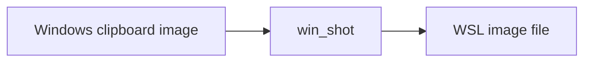

# dsh-wsl-shot
> **Install set:** part of [dsh-wsl-kit](https://github.com/173787247/dsh-wsl-kit). Prefer `KIT_SET=daily` | `llm` | `github` | `full` (see kit README). Fault tree: [TROUBLESHOOTING.md](https://github.com/173787247/dsh-wsl-kit/blob/master/docs/TROUBLESHOOTING.md).


DeepSeek Harness plugin: Save a Windows clipboard image into a WSL file for multimodal chat.

Part of **[dsh-wsl-kit](https://github.com/173787247/dsh-wsl-kit)**.

[中文说明 → README.zh.md](./README.zh.md)

## Where it sits

Saves a Windows clipboard image into a WSL file so the agent can attach it.



Suite diagram and version snapshot: [dsh-wsl-kit](https://github.com/173787247/dsh-wsl-kit#how-the-pieces-fit). This plugin is **0.1.0** (full). Do not copy that matrix into this README.


## Compatibility

| Field | Value |
|-------|-------|
| **Plugin** | `dsh-wsl-shot` **0.1.0** |
| **Minimum dsh** | ≥ **0.1.2** (web UI one-shot `?token=` on Windows relay `:3081`) |
| **Latest verified** | See [dsh-wsl-kit Compatibility](https://github.com/173787247/dsh-wsl-kit#compatibility-2026-09) (currently **`0.1.7-alpha.2`**) — single source of truth for the suite |
| **Kit set** | `full` or install alone |
| **Cloud Flash** | Use model id **`deepseek-flash`** (V4.1 Flash) in `~/.dsh/settings.yaml` / `llm-deepseek` — not configured by this plugin |
| **Agent Teams** | Upstream experimental; not required here |

Suite floor versions: kit [`check-plugin-versions.sh`](https://github.com/173787247/dsh-wsl-kit/blob/master/scripts/check-plugin-versions.sh). Fault tree: [TROUBLESHOOTING.md](https://github.com/173787247/dsh-wsl-kit/blob/master/docs/TROUBLESHOOTING.md).

## Install

```sh
dsh plugin --profile web add github:173787247/dsh-wsl-shot
# or local:
dsh plugin --profile web add /absolute/path/to/dsh-wsl-shot
```

Restart `dsh web` and open a **new** session. Tool: `win_shot`.

## License

MIT
